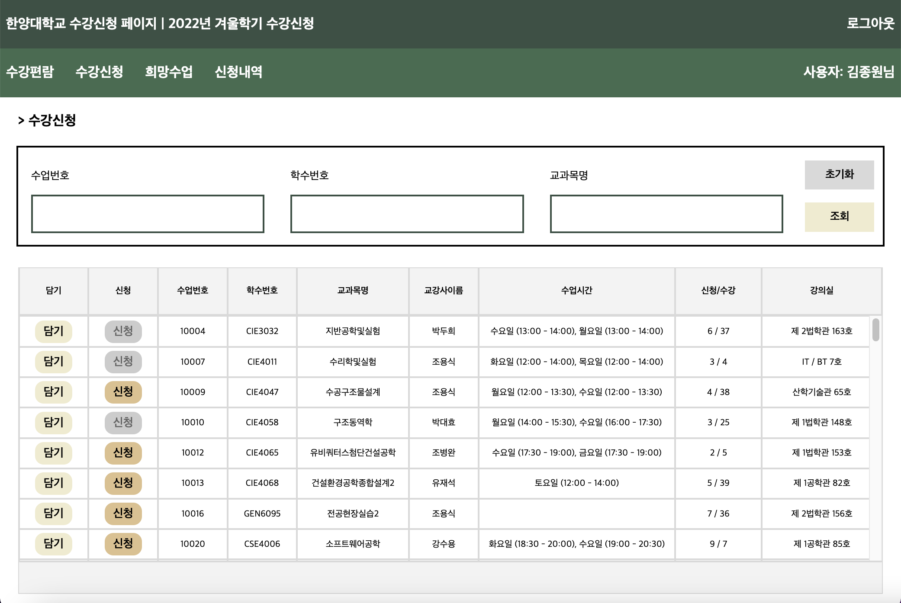

# sugang system



## description
<!-- [한양대학교 수강신청 시스템](https://portal.hanyang.ac.kr/sugang/sulg.do)   -->
Implement the main functions of the course registration system  
- add administrator page
- student timetable

### default environment
```
Tomcat 10.0.27  
SDK Amazon Corretto version 15.0.2  
```

### execution
1. project build
2. tomcat connection  
no backend server implementation  
(design and check database on localhost)